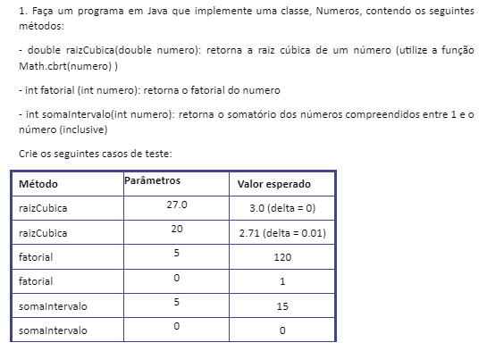
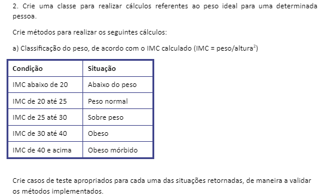

# EXERCÍCIOS DE TESTE UNITÁRIOS EM JAVA

<h1>Matéria:</h1> 
<h2>Gestão e Qualidade de Software | Centro Universitário UNA</h2>

Testes Unitários | Exercicío 01 | 01

 

Testes Unitários | Exercicío 01 | 02

 
